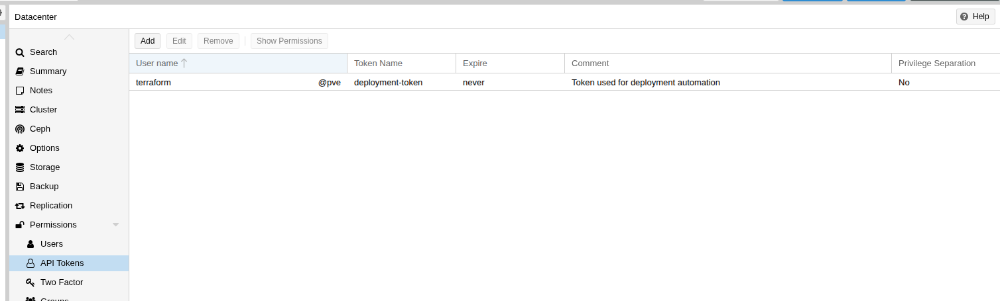

# Proxmox Users and Roles Configuration

This configuration creates dedicated automation users and custom roles for Terraform and Packer operations on your Proxmox server. These components are essential for infrastructure automation and must be configured with appropriate permissions.

## Prerequisites

- Proxmox server is running and accessible
- Terraform provider for Proxmox is configured
- Administrative access to Proxmox server
- Network connectivity between controller node and Proxmox server

## Configuration

### Module Location

`resources/proxmox/00_proxmox_administration/00_users_and_roles`

### Configure Backend

Copy the example backend config, then edit it to point to your S3 state bucket:

```bash
cp backend.config.example backend.config
```

```hcl
bucket = "your-actual-s3-bucket-name"
region = "us-east-1"
```


## Deploy

```bash
terraform init -backend-config=backend.config
terraform plan
terraform apply
```

### Configure Variables

The following variables will be prompted during deployment:

| Variable | Type | Description | Default | Required |
|---|---|---|---|---|
| `proxmox_endpoint` | string | The URL of the Proxmox endpoint (Format: https://proxmox-host-ip:8006) |  | Yes |
| `s3_bucket` | string | Name of the S3 bucket used as Terraform backend | - | Yes |
| `virtual_environment_username` | string | Username (with realm) for Proxmox authentication | - | Yes |
| `virtual_environment_password` | string | Password for Proxmox authentication | - | Yes |
| `user_initial_password` | string | Initial password for created users | - | Yes |

## Created Users

### Terraform PVE User (`terraform@pve`)

**Purpose**: Primary automation user for Terraform operations

**Permissions**:
- **VM Management**: Full administrative access to `/vms` path with `PVEVMAdmin` role
- **Storage Management**: Administrative access to `/storage` path with `PVEDatastoreAdmin` role  
- **SDN Management**: Administrative access to `/sdn` path with `PVESDNAdmin` role
- **System Audit**: System modification and audit permissions with `SysModifyAudit` role

**Groups**: Standard

## Created Roles

### SysModifyAudit Role

**Role ID**: `SysModifyAudit`

**Purpose**: Provides system modification and audit capabilities for automation users

**Privileges**:
- **Sys.Audit**: System audit permissions for monitoring and logging
- **Sys.Modify**: System modification permissions for infrastructure changes

**Usage**: This role is assigned to the `terraform@pve` user to provide necessary permissions for:
- System configuration changes
- Audit trail maintenance
- Infrastructure monitoring
- Automated system modifications

## Post-deployment

### Generate API Token

After the users and roles are created, you need to generate API tokens for the automation users to use with Terraform and Packer.

#### For Terraform User (`terraform@pve`)

1. **Access Proxmox Web Interface**
   - Navigate to your Proxmox server web interface (typically `https://your-proxmox-ip:8006`)
   - Log in with your administrative credentials

2. **Navigate to User Management**
   - Go to **Datacenter** → **Permissions** → **API Tokens**
   - Click on `Add`

3. **Token Configuration**
   - Configure the token:
     - **User**: Choose `terraform@pve`
     - **Token ID**: `deployment-token` (or your preferred name)
     - **Privilege Separation**: Leave unchecked (token inherits user permissions)
     - **Expiration**: Set according to your security policy (optional)
     - **Comment**: Input your comment here (optional)
   - Click **"Generate"**

4. **Save Token Credentials**
   - **Important**: Copy and securely store the generated token
   - The token will be displayed as: `terraform@pve!terraform-token=xxxxxxxx-xxxx-xxxx-xxxx-xxxxxxxxxxxx`
   - This token will be used in your Terraform provider configuration

