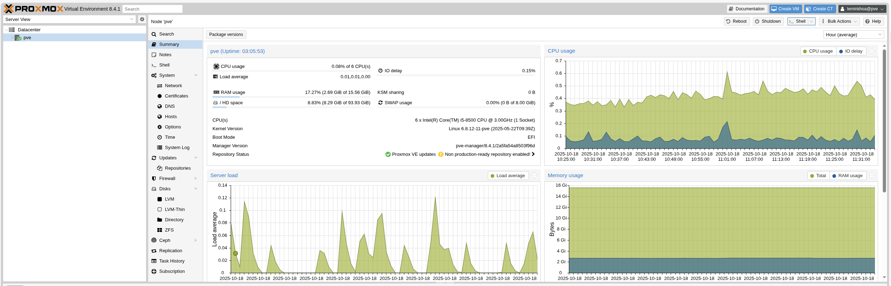

# Proxmox Node Installation Guide

This guide will walk you through installing Proxmox Virtual Environment (PVE) on your hardware to create a Proxmox node for your homelab setup.

## Prerequisites

Before starting the installation, ensure your hardware meets the [Proxmox system requirements](https://pve.proxmox.com/wiki/System_Requirements):

- **CPU**: 64-bit x86 processor with hardware virtualization support (Intel VT-x or AMD-V)
- **RAM**: Minimum 2GB, recommended 8GB or more
- **Storage**: Minimum 32GB for installation, recommended SSD for better performance
- **Network**: Ethernet connection for management interface

## Download and Prepare Installation Media

1. **Download Proxmox VE ISO**
   - Visit the [Proxmox download page](https://www.proxmox.com/en/downloads/proxmox-virtual-environment)
   - Download the latest Proxmox VE ISO image
   - The ISO file is approximately 1.1GB

2. **Create Bootable USB Drive**
   - Use tools like [Rufus](https://rufus.ie/) (Windows), [Balena Etcher](https://www.balena.io/etcher/) (cross-platform), or `dd` command (Linux/macOS)
   - Write the ISO image to a USB flash drive (minimum 4GB capacity)

## Installation Process

### Step 1: Boot from Installation Media

1. Insert the bootable USB drive into your target hardware
2. Power on the system and access the BIOS/UEFI settings
3. Configure the boot order to prioritize USB devices
4. Save settings and restart
5. Select "Install Proxmox VE" from the boot menu

### Step 2: Installation Wizard

1. **Welcome Screen**: Press `Enter` to start the installation
2. **License Agreement**: Accept the license terms
3. **Target Hard Disk**: 
   - Select the disk where Proxmox will be installed
   - ⚠️ **Warning**: This will erase all existing data on the selected disk
4. **Location and Time Zone**: Configure your geographic location and timezone
5. **Administration Password**: Set a strong password for the `root` user
6. **Network Configuration**:
   - Configure the management interface (usually the first Ethernet port)
   - Set a static IP address or use DHCP
   - Configure hostname (e.g., `pve-node-01`)
   - Set DNS servers

### Step 3: Complete Installation

1. Review your configuration settings
2. Click "Install" to begin the installation process
3. Wait for the installation to complete (typically 10-15 minutes)
4. Reboot the system when prompted
5. Remove the installation media

## Post-Installation Configuration

### Access the Web Interface

After installation, you can access the Proxmox web interface:

1. **Open a web browser** and navigate to: `https://your-proxmox-ip:8006`
2. **Accept the self-signed certificate** warning (you can replace this with a proper certificate later)
3. **Login** with:
   - **Username**: `root`
   - **Password**: The password you set during installation
   - **Realm**: `pam` (default)



### Initial System Configuration

1. **Update the System**:
   ```bash
   apt update && apt upgrade -y
   ```

2. **Configure Storage**:
   - Navigate to **Datacenter** → **Storage**
   - Add additional storage pools if needed (local, NFS, iSCSI, etc.)

3. **Network Configuration**:
   - Verify network settings in **System** → **Network**
   - Configure additional network interfaces if required

4. **Subscription Management**:
   - For production use, consider purchasing a Proxmox subscription
   - For homelab use, you can use the free community repository

### Verify Installation

Check that your Proxmox node is properly configured:

1. **System Information**: Verify CPU, RAM, and storage are detected correctly
2. **Network Connectivity**: Ensure the management interface is accessible
3. **Storage**: Confirm local storage is available and properly configured
4. **Updates**: Check that the system can access Proxmox repositories

## Next Steps

With your Proxmox node successfully installed, you can now:

1. **Create Virtual Machines**: Use the web interface to create your first VMs
2. **Set up Containers**: Deploy lightweight LXC containers
3. **Configure Backup**: Set up automated backups for your VMs and containers
4. **Join a Cluster**: Add additional nodes to create a high-availability cluster
5. **Deploy Infrastructure**: Use the Terraform configurations in this repository to automate your homelab setup

## Troubleshooting

### Common Issues

- **Network not accessible**: Check firewall settings and network configuration
- **Storage not detected**: Verify disk connections and check for hardware issues
- **Web interface not loading**: Ensure the `pveproxy` service is running
- **Certificate warnings**: This is normal for self-signed certificates; you can replace them later

### Useful Commands

```bash
# Check system status
systemctl status pve-cluster

# View system logs
journalctl -u pve-cluster

# Restart Proxmox services
systemctl restart pve-cluster

# Check storage
pvesm status
```

## Security Considerations

- **Change default passwords**: Use strong, unique passwords
- **Configure firewall**: Restrict access to management interfaces
- **Regular updates**: Keep the system updated with security patches
- **Backup configuration**: Regularly backup your Proxmox configuration
- **Network isolation**: Consider isolating management traffic from VM traffic

For more detailed information, refer to the [official Proxmox documentation](https://pve.proxmox.com/wiki/Main_Page).
