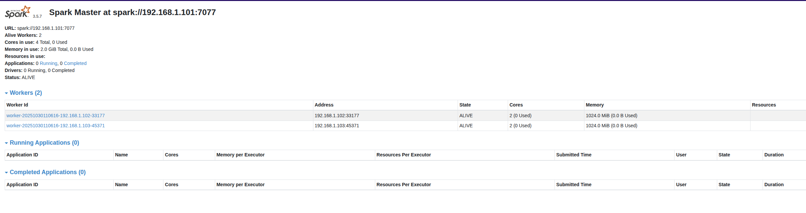

# Spark Cluster Deployment

This guide walks you through deploying a Spark cluster on Proxmox using Terraform and Ansible. The deployment consists of 4 main steps that must be executed in order.

## Prerequisites

Before starting, ensure you have:
- A running Proxmox VE server
- Vault configured with necessary secrets
- Terraform installed
- Ansible installed
- Completed [Hashicorp Vault setup](../../../initial_setup/vault/index.md)

## Set up environment variables

> Note: If you haven't completed this setup [Setting Environment Variables](../../general_guidelines/set_environment.md), please follow the instructions from this page before proceeding to the next steps.

## Build Template (spark_base)

This step creates a base VM template with Spark pre-installed that will be used to deploy the cluster.

```bash
cd terraform/templates/spark_base
terraform init
terraform plan
terraform apply
```


## Update config/vms.yml

Configure your Spark cluster by updating the VM specifications in the configuration file.

```yaml
spark_cluster:
  vms:
    masters:
      hosts:
        - name: "spark-master-1"
          id: 2000
          ip: "192.168.1.101"
          tags: ["vm", "spark_master"]
          vars:
            role: "master"
            spark_master_port: "7077"
            spark_web_ui_port: "8080"
      template_id: 1001

    workers:
      hosts:
        - name: "spark-worker-1"
          id: 2001
          ip: "192.168.1.102"
          tags: ["vm", "spark_worker"]
          vars:
            role: "worker"
            spark_worker_port: "8081"
            spark_worker_web_ui_port: "8081"

        - name: "spark-worker-2"
          id: 2002
          ip: "192.168.1.103"
          tags: ["vm", "spark_worker"]
          vars:
            role: "worker"
            spark_worker_port: "8081"
            spark_worker_web_ui_port: "8081"
      template_id: 1001
```

**Configuration options:**
- **Masters**: Define Spark master nodes with their IPs and ports
- **Workers**: Define Spark worker nodes with their IPs and ports
- **Template ID**: Must reference the ID of the template
- **IP Addresses**: Ensure they don't conflict with existing VMs
- **VM IDs**: Must be unique across your Proxmox environment

## Deploy VM with Terraform (spark/)

Deploy the actual Spark cluster using the configuration from Step 3.

```bash
cd terraform/deployments/spark
terraform init
terraform plan
terraform apply
```

**What this does:**
- Creates Spark master VM(s) from the template
- Creates Spark worker VM(s) from the template
- Configures network settings and cloud-init
- Runs Ansible playbooks to configure Spark services
- Sets up master and worker roles with proper networking

**Deployment includes:**
- **Spark Master**: Web UI on port 8080, master port 7077
- **Spark Workers**: Web UI on port 8081, worker ports 8081
- **Ansible Configuration**: Automated setup of Spark services
- **Network Configuration**: Proper gateway and IP assignment

## Verification

After deployment, verify your Spark cluster:

1. **Check VM Status**: Ensure all VMs are running in Proxmox
2. **Access Spark Master Web UI**: Navigate to `http://<Spark master IP>:8080`
3. **Check Worker Registration**: Verify workers appear in the master UI
4. **Test Spark Shell**: SSH into master and run `spark-shell`




## Cleanup

To remove the Spark cluster:

```bash
cd terraform/deployments/spark
terraform destroy
```

To remove the base template:

```bash
cd terraform/templates/spark_base
terraform destroy
```

**Note**: This will permanently delete all VMs and templates. Ensure you have backups if needed.
