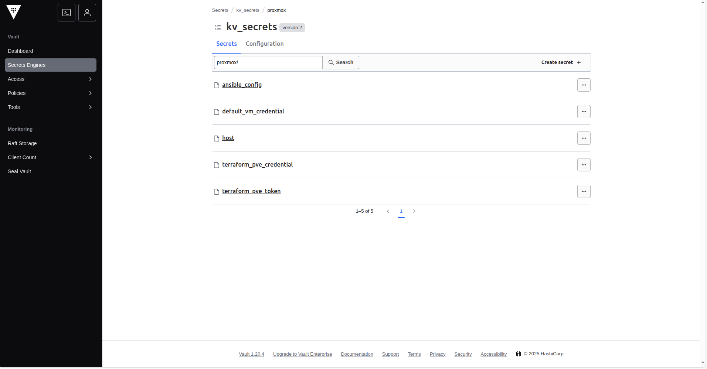

# Vault Components Setup

## Overview

Configures HashiCorp Vault with authentication methods, policies, and secrets engines. This step establishes secure access control and prepares Vault for secret management operations.

## Prerequisites

- [Vault server](./vault_server.md) deployed and accessible
- Client certificate downloaded
- Root token available
- Terraform installed

## Configuration

### Module Location

```bash
resources/proxmox/02_vault/02_vault_components
```

### Set Vault Environment Variables

Configure Vault connection using the client certificate from the [Vault Image](./vault_image.md#post-deployment) and the token generated from the [Vault Server Deployment](./vault_server.md#post-deployment) step:

```bash
export VAULT_TOKEN="hvs...."
export VAULT_ADDR="https://<vm-ip>:8200"
export VAULT_CACERT="<path-to-client.pem>"
```


### Deploy Vault Components

```bash
terraform init -backend-config="./backend.config"
terraform plan
terraform apply
```

## Configure Variables
The following variables will be prompted during deployment:


| Variable | Description | Type | Default | Required |
|----------|-------------|------|---------|----------|
| `admin_username` | Username for admin user | `string` | - | Yes |
| `admin_password` | Password for admin user | `string` | - | Yes |


## Post-Deployment Setup

### **Access Vault UI**

1. **Navigate to Vault UI**:
   ```
   https://<vm-ip>:8200/ui
   ```

2. **Login with root token**:
   - Use token from `vault_init_output.txt`
   - Format: `hvs.<token-value>`

### **Create Required Secrets**

Navigate to `Secrets / kv_secrets / proxmox` and create the following KV secrets:

#### **Ansible Configuration**
- **Secret Name**: `ansible_config`
- **Required Fields**:
  - `ssh_user`: SSH username for Ansible connections

#### **Default VM Credentials**
- **Secret Name**: `default_vm_credential`
- **Required Fields**:
  - `username`: Default VM username (e.g., `ubuntu`, `root`)
  - `password`: Default VM password

#### **Proxmox Host Configuration**
- **Secret Name**: `host`
- **Required Fields**:
  - `endpoint`: Proxmox server URL (e.g., `https://192.168.1.100:8006`)
  - `gateway_address`: Network gateway IP (e.g., `192.168.1.1`)
  - `nodename`: Proxmox node name (e.g., `pve`)

#### **Terraform PVE Credentials**
- **Secret Name**: `terraform_pve_credential`
- **Required Fields**:
  - `user_id`: PVE user ID (e.g., `terraform@pve`)
  - `password`: PVE user password

#### **PVE Control API Token**
- **Secret Name**: `terraform_pve_token`
- **Required Fields**:
  - `token_name`: API token name (e.g., `deployment-token`)
  - `token_secret`: API token secret key (Generated secret value from Proxmox UI)
  - `token_username`: Associated username (e.g., `terraform@pve`)

> **Security Note**: Store all credentials securely and rotate them regularly. These secrets provide access to your Proxmox infrastructure and should be treated as highly sensitive.

After setting, you should have similar UI like this:
