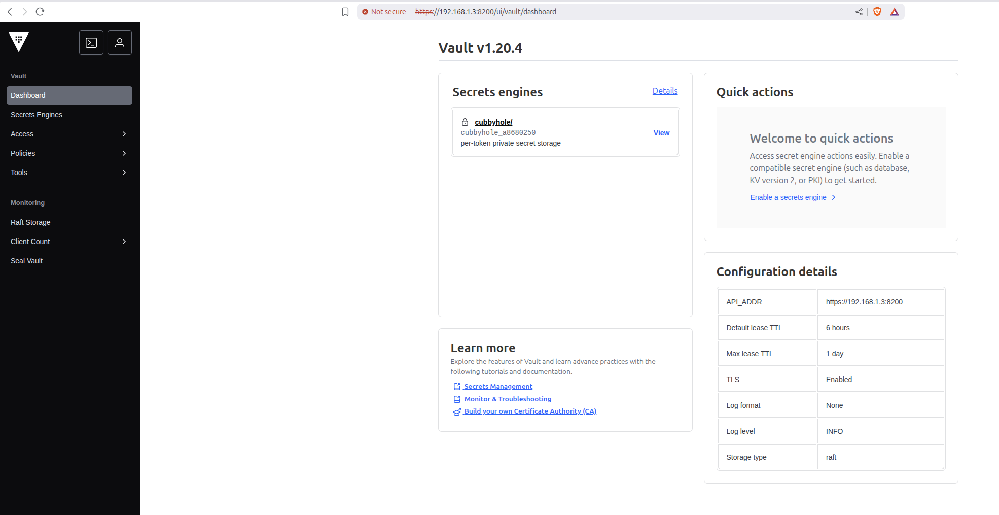

# Vault Server Deployment

## Overview

Deploys the HashiCorp Vault server using the custom image created in the previous step. This creates a production-ready Vault server with secure configuration and client certificate generation.

## Prerequisites

- [Vault image](./vault_image.md) created in previous step
- Terraform installed
- Environment variables configured
- Proxmox server accessible

## Configuration

### Module Location

```bash
resources/proxmox/02_vault/01_vault_server
```

### Configure Backend

Copy the backend configuration example and update the values:

```bash
cp backend.config.example backend.config
```

Edit `backend.config` and update the S3 bucket name:

```hcl
bucket = "your-actual-s3-bucket-name"
region = "us-east-1"
```

### Deploy Vault Server

```bash
terraform init -backend-config="./backend.config"
terraform plan
terraform apply
```

### Configure Variables

The following variables will be prompted during deployment:

| Variable | Type | Description | Default | Required |
|---|---|---|---|---|
| `proxmox_endpoint` | string | The URL of the Proxmox endpoint (Format: https://proxmox-host-ip:8006) |  | Yes |
| `user_terraform_password` | string | Password to login as terraform@pve user for deployment |  | Yes |
| `vm_source_template_id` | number | The ID of VM template to be cloned from | | Yes |
| `vm_id` | number | ID of the VM (Please use range from 2000 to 3999) |  | Yes |
| `vm_ip` | string | Static IP address for the VM (Example: 192.168.1.3) |  | Yes |
| `vm_username` | string | Username to login to VM |  | Yes |
| `vm_password` | string | Password to login to VM |  | Yes |

> **Note:** Besides the variables listed above, you can customize additional VM settings (CPU cores, memory, disk size, etc.) by editing the `variables.tf` file directly for advanced configuration.

## Server Configuration

### **VM Specifications**
- **CPU**: 2 cores
- **Memory**: 4 GB
- **Disk**: 20 GB
- **Network**: Bridge connection
- **Template**: Custom Vault image

### **Security Features**
- **TLS Encryption**: HTTPS communication enabled
- **Client Certificates**: Secure certificate-based authentication
- **KMS Integration**: AWS KMS for key management
- **Firewall Rules**: Restricted network access

## Post-Deployment

3. **Download vault_init_output.txt**:
   - Copy the content from `vault_init_output.txt` to a secure location
   - This file contains the **root token** and **unseal keys**
   - The root token is used to authenticate as the root user in Vault
   - Move and store this file into a more secured location as it provides full administrative access


After deployment, we can access the Vault UI at `https://<ip>:8200`. Enter the root token for first time login!


Once login successfully, we should see a dashboard as below. Congrats! We're now ready to use Hashicorp Vault for further steps!

